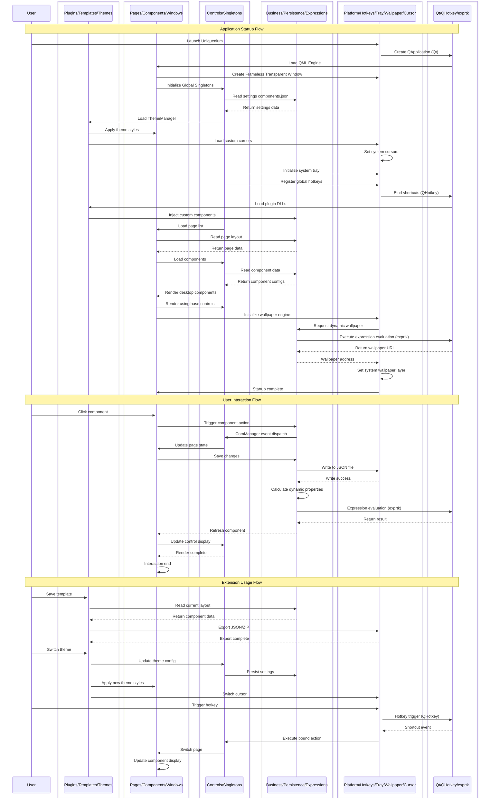

---
# https://vitepress.dev/reference/default-theme-home-page
layout: home

hero:
  name: "Uniquenium"
  text: "Create Infinite Possibilities"
  tagline: A highly flexible open-source desktop customization tool
  image:
    light: /uq-l.png
    dark: /uq-d.png
    alt: Uniquenium Logo
  actions:
    - theme: brand
      text: Download Now
      link: /en/download.md
    - theme: alt
      text: Quick Start
      link: /en/quick-start/install.md
    - theme: alt
      text: GitHub
      link: https://github.com/Uniquenium/Uniquenium

features:
  - title: Multi-Page Workspaces
    icon: 🗂️
    details: Native multi-page support with independent components, layers and names for each page, letting you build your own desktop workspaces
    link: /en/components-wiki/overview.md#creating-pages
    linkText: Learn about pages

  - title: QML at Your Fingertips
    icon: 📝
    details: All controls are written in QML and can be freely modified to customize appearance and behavior with zero barrier to deep customization
    link: /en/controls-reference/overview.md
    linkText: Browse the control library

  - title: Import & Export Resources
    icon: 📦
    details: One-click import and export of templates and plugins, with packaging and version migration to share excellent layouts across users
    link: /en/custom-developing/template.md
    linkText: Use templates

  - title: Rich Control Library
    icon: 🧩
    details: Built-in UniDesk library with 40+ self-developed QML controls covering windows, buttons, menus, charts and more
    link: /en/controls-reference/overview.md
    linkText: Browse the control library

  - title: Plugin Ecosystem
    icon: 🔌
    details: C++ DLL + QML plugin architecture. Install the official plugin pack, or extend new components and backends yourself
    link: /en/official-plugins.md
    linkText: Official plugins

  - title: Dynamic Text via Expressions
    icon: 🧮
    details: Built-in UniDeskExpr engine. Use `%{value}` syntax to reference system data, API responses or presets in real time
    link: /en/custom-developing/template.md
    linkText: Learn about expressions

  - title: Shortcuts & Tray
    icon: ⚡
    details: Global hotkeys, a persistent system tray and one-click access to the main panel — your desktop, always one keystroke away
    link: /en/components-wiki/overview.md#keyboard-shortcuts
    linkText: Configure shortcuts

  - title: Frameless & Acrylic
    icon: 🎨
    details: Custom frameless windows with Acrylic blur effects and automatic light/dark theme switching to refresh your desktop
---

## What is Uniquenium?

**Uniquenium** is an open-source desktop customization tool dedicated to providing users with a highly flexible desktop extension platform. It is built on the **C++/Qt** and **QML** technology stack, with its own UI control library **UniDesk** to make your desktop look brand new.

### Architecture Overview

<div align="center">



</div>

| Layer | Tech Stack | Core Responsibilities |
|-------|-----------|----------------------|
| **Extension Layer** | QML / C++ DLL | Dynamic plugin loading, template import/export, theme and cursor style switching |
| **Presentation Layer** | QML / Qt Quick | Multi-page management, component drag-and-drop editing, frameless window rendering |
| **Control Library** | QML + C++ (UniDesk) | 40+ self-developed controls, desktop container components, global singleton objects |
| **Logic Layer** | C++17 / Qt6 | Data persistence, business scheduling, expression engine evaluation |
| **Integration Layer** | Win32 API / QHotkey | Platform APIs, global hotkeys, system tray, wallpaper engine, cursor management |
| **Dependencies** | Qt 6.5+ / QHotkey / exprtk | Cross-platform framework, hotkey library, expression evaluation library |

## Core Features

::: tip Tech Stack
- **Frontend Rendering**: QML / Qt Quick
- **Backend Logic**: C++17 / Qt6
- **UI Library**: UniDesk (self-developed control library)
- **Extension Support**: Plugin system + Template system
:::

### Desktop Beautification
- Custom wallpaper layer with multi-image carousel and network wallpaper API support
- Global cursor style customization
- Window transparency and Acrylic blur effects

### Utilities
- Component-based desktop panels (to-do, clock, weather, calendar, etc.)
- System tray icon and quick menu
- Global shortcut binding

### Developer Friendly
- Complete UniDesk control library documentation
- Plugin development guide and API reference
- Visual component editor

## Quick Start

```bash
# Clone the repository
git clone https://github.com/Uniquenium/Uniquenium.git
cd Uniquenium
git submodule update --init --recursive

# Build (requires CMake 3.25+ and Qt 6.5+)
cmake -B build -DCMAKE_PREFIX_PATH="<Your Qt6 installation path>"
cmake --build build --config Release

# Run
./build/Uniquenium0
```

Need help? Check the [Installation Guide](/en/quick-start/install.md) or [FAQ](/en/faq.md).

## Join the Community

Found an issue or want to contribute? Contact us through:

- 💻 [GitHub Repository](https://github.com/Uniquenium/Uniquenium) - Submit Issues and PRs
- 📖 [DeepWiki Docs](https://deepwiki.com/Uniquenium/Uniquenium) - Interactive documentation
- 🐛 [Issue Tracker](https://github.com/Uniquenium/Uniquenium/issues) - Report bugs

---

::: info 🤖 AI-Generated Statement
The documentation on this site is AI-assisted and may contain misrepresentations, outdated information, or inconsistencies with the actual code. If you find any errors or have suggestions for improvement, please provide feedback via [GitHub Issues](https://github.com/Uniquenium/Uniquenium/issues) or directly [edit this page](https://github.com/Uniquenium/Docs/edit/main/en/index.md) to submit a PR.
:::