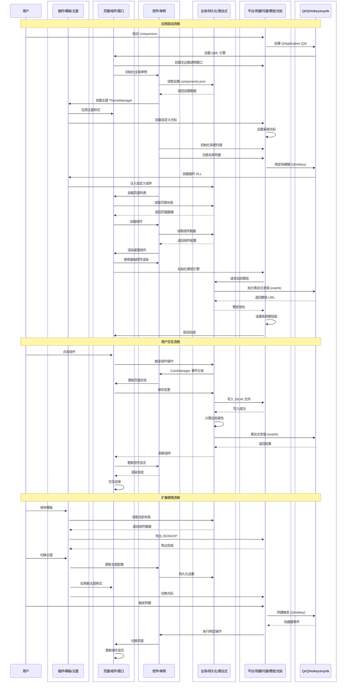

---
# https://vitepress.dev/reference/default-theme-home-page
layout: home

hero:
  name: "Uniquenium"
  text: "创造无限可能"
  tagline: 高度自由的开源桌面自定义工具
  image:
    light: /uq-l.png
    dark: /uq-d.png
    alt: Uniquenium Logo
  actions:
    - theme: brand
      text: 立即下载
      link: /download.md
    - theme: alt
      text: 快速开始
      link: /quick-start/install.md
    - theme: alt
      text: GitHub
      link: https://github.com/Uniquenium/Uniquenium

features:
  - title: 🗂️ 多页面分页
    icon: 🗂️
    details: 原生支持多页面分页管理，每页拥有独立组件、层级与名称，轻松构建属于自己的桌面工作台
    link: /components-wiki/overview.md#创建页面
    linkText: 了解分页

  - title: 📝 QML 自由改写
    icon: 📝
    details: 所有控件均由 QML 编写，可直接修改源文件自定义外观与行为，真正做到零门槛深度定制
    link: /controls-reference/overview.md
    linkText: 查看控件库

  - title: 📦 资源导入导出
    icon: 📦
    details: 模板、插件一键导入导出，支持打包分享与版本迁移，让优秀布局在用户之间自由流通
    link: /custom-developing/template.md
    linkText: 使用模板系统

  - title: 🧩 丰富控件
    icon: 🧩
    details: 内置 UniDesk 控件库，包含 40+ 种自研 QML 控件，覆盖窗口、按钮、菜单、图表等常见场景
    link: /controls-reference/overview.md
    linkText: 查看控件库

  - title: 🔌 插件生态
    icon: 🔌
    details: 基于 C++ DLL + QML 的插件体系，官方提供官方插件包，也支持用户自行扩展新组件与后端能力
    link: /official-plugins.md
    linkText: 官方插件

  - title: 🧮 表达式动态文本
    icon: 🧮
    details: 内置 UniDeskExpr 表达式引擎，通过 `%{value}` 语法实时引用系统数据、API 响应或预设变量
    link: /custom-developing/template.md
    linkText: 了解表达式

  - title: ⚡ 快捷键 & 托盘
    icon: ⚡
    details: 全局热键绑定、系统托盘常驻、一键唤出主面板，桌面随叫随到
    link: /components-wiki/overview.md#快捷键设置
    linkText: 设置快捷键

  - title: 🎨 无边框 & 亚克力
    icon: 🎨
    details: 自定义无边框窗口与毛玻璃亚克力效果，浅色/深色主题自动切换，让桌面焕然一新
    link: /controls-reference/UniDeskWindow.md
    linkText: 窗口控件
---

## Uniquenium 是什么？

**Uniquenium** 是一款开源的桌面自定义工具，致力于为用户提供一个高度自由的桌面扩展平台。它基于 **C++/Qt** 和 **QML** 技术栈构建，拥有自己的 UI 控件库 **UniDesk**，让你的桌面焕然一新。

### 架构总览

<div align="center">



</div>

| 层级 | 技术栈 | 核心职责 |
|------|--------|----------|
| **🔌 扩展层** | QML / C++ DLL | 插件动态加载、模板导入导出、主题与光标样式切换 |
| **🎨 表现层** | QML / Qt Quick | 多页面管理、组件拖拽编辑、无边框窗口渲染 |
| **🧩 控件库** | QML + C++ (UniDesk) | 40+ 自研控件、桌面容器组件、全局单例对象 |
| **⚙️ 逻辑层** | C++17 / Qt6 | 数据持久化、业务调度、表达式引擎求值 |
| **🖥️ 集成层** | Win32 API / QHotkey | 平台 API、全局热键、系统托盘、壁纸引擎、光标管理 |
| **📦 依赖** | Qt 6.5+ / QHotkey / exprtk | 跨平台框架、热键库、表达式求值库 |

## 核心特性

::: tip 技术栈
- **前端渲染**：QML / Qt Quick
- **后端逻辑**：C++17 / Qt6
- **UI 库**：UniDesk（自研控件库）
- **扩展支持**：插件系统 + 模板系统
:::

### 桌面美化
- 自定义壁纸层，支持多图轮播和网络壁纸 API
- 全局光标样式自定义
- 窗口透明与亚克力模糊效果

### 实用工具
- 组件化桌面面板（待办、时钟、天气、日历等）
- 系统托盘图标与快速菜单
- 全局快捷键绑定

### 开发者友好
- 完整的 UniDesk 控件库文档
- 插件开发指南与 API 参考
- 可视化组件编辑器

## 快速开始

```bash
# 克隆项目
git clone https://github.com/Uniquenium/Uniquenium.git
cd Uniquenium
git submodule update --init --recursive

# 构建（需要 CMake 3.25+ 和 Qt 6.5+）
cmake -B build -DCMAKE_PREFIX_PATH="<你的Qt6安装路径>"
cmake --build build --config Release

# 运行
./build/Uniquenium0
```

还需要帮助？查看 [安装指南](/quick-start/install.md) 或 [常见问题](/faq.md)。

## 加入社区

遇到问题或想要贡献代码？欢迎通过以下方式联系我们：

- 💻 [GitHub 仓库](https://github.com/Uniquenium/Uniquenium) - 提交 Issue 与 PR
- 📖 [DeepWiki 文档](https://deepwiki.com/Uniquenium/Uniquenium) - 交互式文档
- 🐛 [问题反馈](https://github.com/Uniquenium/Uniquenium/issues) - 报告 Bug

---

::: info 🤖 AI 生成声明
本网站文档由 AI 辅助生成，可能存在表述偏差、信息过时或与实际代码不一致之处。如果你发现任何错误或有改进建议，欢迎通过 [GitHub Issues](https://github.com/Uniquenium/Uniquenium/issues) 反馈，或直接 [编辑此页面](https://github.com/Uniquenium/Docs/edit/main/zh/index.md) 提交 PR。
:::